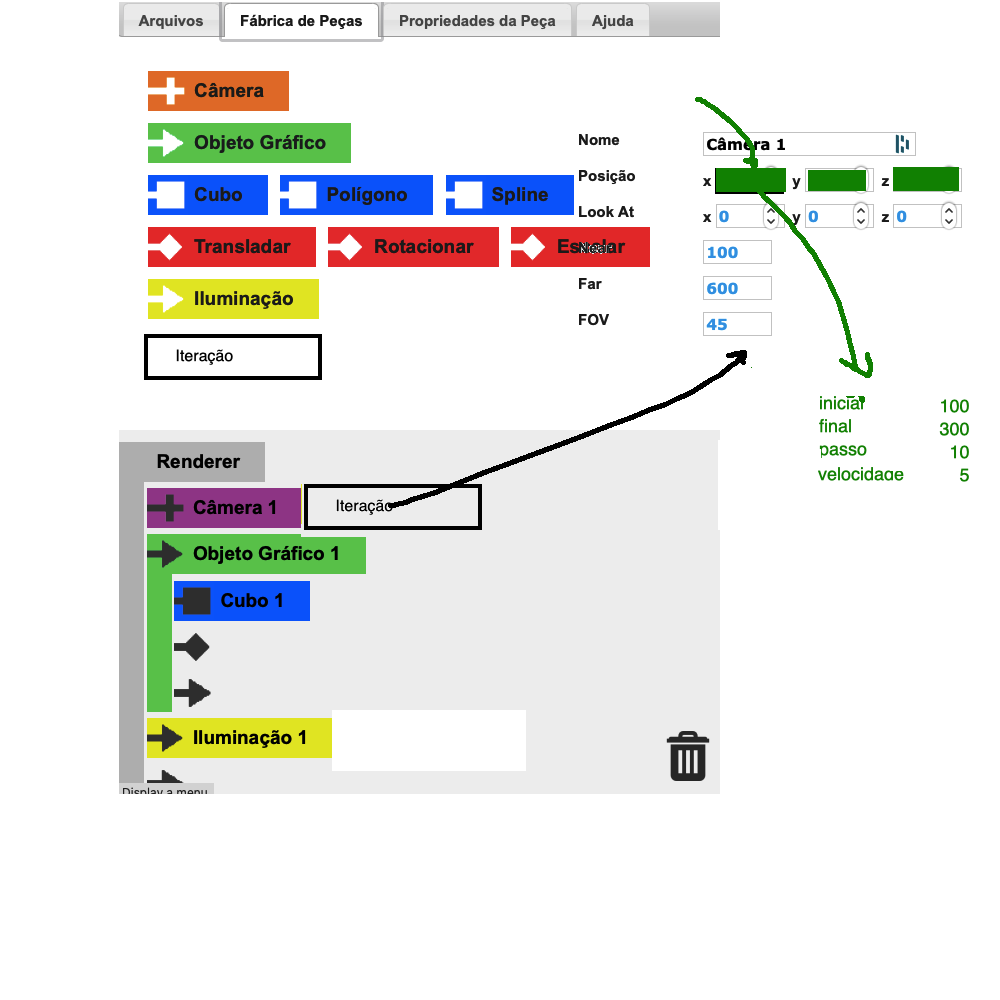

# Anotações das Reuniões

GIT: <https://github.com/dalton-reis/tcc_DouglasEduardoBauler>  

## 2020-01-25

Cobrei qual assunto teria preferêcia para o TCC.  

## 2021-03-15

Pediu uma reunião para definir o que poderia continuar no TCC do Peterson.  
Disse que olhou o código e tens vários ajustes que pode fazer para melhorar o código. No caso refatorar.  

### Lista de opções de continuação do TCC Peterson

- Refatorar ("arrumar") código Perteson (20%)  
- Nova funções (TCCs anteiores e olhar <http://gcg.inf.furb.br/visedu-cg/game/>)
  - Peça nova Iteração (30%) ... não tinha no antigo  
- Rotina export/impor (plus) cadeado (20%)  
- Dependente do que se tem -> Tutorial (continuar) (25%)  

### Material anterior

Passei todo o material dos TCCs anteriores para poder ver o que foi feito e não desenvolvido no TCC do Peterson.  

- TCC da Luciana Pereira de Araújo  
- TCC do Anderson: <http://dsc.inf.furb.br/arquivos/tccs/monografias/2014_1_samuel-anderson-nunes_monografia.pdf>  
- TCC do James: <http://dsc.inf.furb.br/arquivos/tccs/monografias/2014_1_james-perkison-montibeler_monografia.pdf>  
- TCC do William: <http://dsc.inf.furb.br/arquivos/tccs/monografias/2015_1_william-fernandes-koehler_monografia.pdf>  

Também passei a versão final dos TCCs anteriores desenvolvida em JavaScript + TreeJS (WebGL):  

- <http://gcg.inf.furb.br/visedu-cg>  
E um exemplo de exercícios que usamos o VisEdu-CG:  
- <http://gcg.inf.furb.br/visedu-cg/exercicios/>  

### Explicação da peça Iteração

  

## 2021-03-30

Tinha dúvidas sobre o pré-projeto, mais na escolha dos trabalhos correlatos.  
Passei por todo um pré-projeto de exemplo exeplicando, e trabalhei mais a importância do quadro de trabalhos correlatos.  
Disponibilizei no GIT o pré-projeto e projeto do Peterson como exemplo.  
Indiquei o TCC da Pamela como um possível trabalho correlato, mais na parte da funcionalidade de módulo de atividades/exercícios para o VisEdu-CG.  

## 2021-05-04

### Defesa Pré-projeto

[Anotações de defesa do Pré-projeto](./tcc_DouglasEduardoBauler_2021-05-04_PreProjeto_Defesa.md)  

## 2021-09-09

- usou Base64 para Bloquear o arquivo JSon  
- testando: salvar/ler  
- prtende fazer o tutorial antes das novas peças  

## 2021-09-16

Reorganizou os layouts de canvas.  
Trouxe o canvas da Ajuda.  
Começou a mexer no artigo, usando correções de TCC1 e Mauricio.  

Vai fazer as peças Splines e Polignos.  
Arrumar ajsutes pequenos.  
E continuar no artigo.  
Ainda não funciona a câmera de baixo (a real).  
Falei para começar com a peça poligono, pois a spline usa o poligono.  
A spline pode ser escolhido a qtd de pontos de controle de 3 até 6.  

## 2021-09-30

Fez a peça poligono, e está funcinando.  
Falta testar a rotina dos pontos.  

- fazer os ajustes nas últimas rotinas.  
- vai voltar a trabalhar no artigo.  

## 2021-10-07

Mexeu um pouco no artigo mas na parte do texto do projeto.  
Vai continuar no artigo, fazer ajustes no poligono (T/S/R) e ajustar a spline.  

## 2021-10-14

Ajustando partes do código para tratar as transformações.  
Spline.  
Melhorar o tutorial.  

## 2021-10-21

Usou um Asset pronto para Spline.  
E ajustes de raforar as peças da fábrica. Mudou as peças da fábrica para painies.  
Mexeu um pouco no artigo.  
Vai fazer a peça de Iteração.  
